# SparkScale Churn: Scalable Customer Churn Prediction


## Project Overview
**SparkScale Churn** is a scalable, distributed machine learning pipeline designed to predict customer attrition in the telecommunications sector. The project name reflects its core architecture: utilizing Apache Spark to handle massive, Terabyte-scale data processing that standard, single-machine tools cannot manage.

## Architecture & Data Flow

```mermaid
flowchart LR
    %% Define Bright and Clear Node Styles
    classDef rawData fill:#FFD700,stroke:#B8860B,stroke-width:3px,color:#000;
    classDef dockerEnv fill:#00BFFF,stroke:#00008B,stroke-width:3px,color:#FFF;
    classDef processing fill:#32CD32,stroke:#006400,stroke-width:3px,color:#FFF;
    classDef mlModel fill:#FF4500,stroke:#8B0000,stroke-width:3px,color:#FFF;
    classDef output fill:#8A2BE2,stroke:#4B0082,stroke-width:3px,color:#FFF;

    A[/"Raw Telecom Logs<br>(~2TB Monthly)"/]:::rawData --> B
    
    subgraph Cluster["Local Spark Cluster Environment"]
        B{"Docker<br>Container"}:::dockerEnv
    end
    
    B --> C
    C["PySpark<br>Distributed ETL"]:::processing --> D
    D["Data Cleansing &<br>Schema Validation"]:::processing --> E
    E["Spark SQL:<br>Feature Engineering"]:::processing --> F
    F["VectorAssembler"]:::processing --> G
    
    G(("Spark MLlib:<br>Distributed RF")):::mlModel --> H
    
    H["Saved Spark<br>Pipeline Artifact"]:::output --> I
    I>Batch Inference<br>Script]:::output --> J
    J((Churn Predictions<br>Next 30 Days)):::output
```

-----
## Problem Statement
A major telecommunications provider generates approximately 2 Terabytes (TB) of log data every month, comprising call records, data usage, and customer complaints.
- **The Technical Bottleneck:** Standard data manipulation tools like Pandas are restricted by single-machine memory limits, resulting in catastrophic memory errors when attempting to load or process this volume of data.
- **The Business Impact:** Without the ability to process this data, the company cannot identify high-value users who are at risk of leaving the service (churning), leading to significant revenue loss.

## Project Objective
The primary objective is to engineer a distributed Machine Learning pipeline capable of predicting which high-value users are likely to churn within the next 30 days.

### Key Production Features Include:
- **Distributed Processing Core:** Utilizing PySpark to distribute the workload of ingesting, cleaning, and feature-engineering the massive dataset across a simulated compute cluster.
- **Scalable Modeling:** Training high-performance models, specifically Distributed Random Forests, using Spark's native MLlib library, which is built for parallel computation.
- **Pipeline Persistence:** Persisting the entire data transformation sequence—including feature engineering and the final trained model—as a single, reusable Spark ML Pipeline object to enable seamless deployment in a production environment.

## Tools & Tech Stack
To achieve true scalability and parallel compute, this project utilizes a specialized big data technology stack:
- **Distributed Compute Engine:** Apache Spark (PySpark) SQL 
- **Machine Learning Library:** Spark MLlib
- **Containerization & Environment:** Docker (utilized for establishing a local single-node Spark master/worker environment)

## Directory Structure
```bush
sparkscale_churn/
├── data/                   # Raw CSVs (.gitignore)
├── src/
│   ├── __init__.py
│   ├── config.py           # Hardcoded paths and Spark configurations
│   ├── logger.py           # Custom logging configuration
│   └── ingest.py           # Week 1: Core ETL Script
├── docker-compose.yml      # Spark Cluster infrastructure
├── requirements.txt        # Python dependencies
└── README.md               # The markdown file we just created
